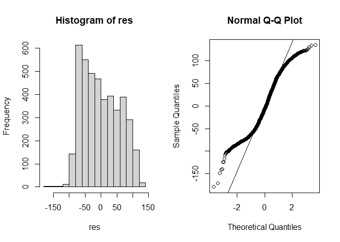

<!-- # Analysis of the top 200 Spotify songs (2017-2021) -->

## What makes a hit song

This essay was written by Cervini Stella (ID num. XXXXXX), Mattia Simone
(ID num. XXXXXX), Montalbano Daniel (ID num. XXXXXX). The goal of this
project is to analyse the characteristics of the top Spotify songs
(between 2017-2021 in global) and eventually discover the common
properties that made these songs so popular in the first place.

### 1. Data

The dataset used for project was retrieved from
[Kaggle](https://www.kaggle.com/datasets/younver/spotify-top-200-dataset).

    raw_dataset <- read.csv("../Dataset/spotify.csv", header = TRUE, sep = ";")

It contains the Spotify Global weekly top 200 songs between 2017-2021.

    dim(raw_dataset)

    ## [1] 74660    40

This dataset consists of a total of 74.661 rows and 40 columns, each row
representing a track and each column containing a different variable
that describes the entity. Here we have the totality of the material
needed for the analysis.

    str(raw_dataset, vec.len = 2, strict.width = "cut")

    ## 'data.frame':    74660 obs. of  40 variables:
    ##  $ track_id          : chr  "5aAx2yezTd8zXrkmtKl66Z" "5aAx2yezTd8zXrkmtKl66Z" ..
    ##  $ track_name        : chr  "Starboy" "Starboy" ...
    ##  $ track_popularity  : int  0 0 84 84 75 ...
    ##  $ track_number      : int  1 1 1 1 1 ...
    ##  $ album_id          : chr  "09fggMHib4YkOtwQNXEBII" "09fggMHib4YkOtwQNXEBII" ..
    ##  $ album_name        : chr  "Starboy" "Starboy" ...
    ##  $ album_img         : chr  "https://i.scdn.co/image/ab67616d0000b2730c8599cb"..
    ##  $ album_type        : chr  "album" "album" ...
    ##  $ album_label       : chr  "Universal Music Group" "Universal Music Group" ...
    ##  $ album_track_number: int  1 1 1 1 1 ...
    ##  $ album_popularity  : int  0 0 71 71 62 ...
    ##  $ artist_num        : int  2 2 2 2 3 ...
    ##  $ artist_names      : chr  "The Weeknd, Daft Punk" "The Weeknd, Daft Punk" ...
    ##  $ artist_id         : chr  "1Xyo4u8uXC1ZmMpatF05PJ" "4tZwfgrHOc3mvqYlEYSvVi" ..
    ##  $ artist_name       : chr  "The Weeknd" "Daft Punk" ...
    ##  $ artist_img        : chr  "https://i.scdn.co/image/ab6761610000e5ebb5f9e282"..
    ##  $ artist_followers  : int  51215861 8953122 19562506 18598273 4943046 ...
    ##  $ artist_popularity : int  94 81 81 84 76 ...
    ##  $ artist_genres     : chr  "canadian contemporary r&b, canadian pop, pop" "e"..
    ##  $ rank              : int  1 1 2 2 3 ...
    ##  $ week              : chr  "1/6/2017" "1/6/2017" ...
    ##  $ collab            : chr  "True" "True" ...
    ##  $ explicit          : chr  "True" "True" ...
    ##  $ release_date      : chr  "2016-11-25" "2016-11-25" ...
    ##  $ danceability      : num  0.681 0.681 0.748 0.748 0.72 ...
    ##  $ energy            : num  0.594 0.594 0.524 0.524 0.763 ...
    ##  $ key               : int  7 7 8 8 9 ...
    ##  $ mode              : int  1 1 1 1 0 ...
    ##  $ time_signature    : int  4 4 4 4 4 ...
    ##  $ loudness          : num  -7.03 -7.03 ...
    ##  $ speechiness       : num  0.282 0.282 0.0338 0.0338 0.0523 ...
    ##  $ acousticness      : num  0.165 0.165 0.414 0.414 0.406 ...
    ##  $ instrumentalness  : num  3.49e-06 3.49e-06 0.00 0.00 0.00 ...
    ##  $ liveness          : num  0.134 0.134 0.111 0.111 0.18 ...
    ##  $ valence           : num  0.535 0.535 0.661 0.661 0.742 ...
    ##  $ tempo             : num  186 186 ...
    ##  $ duration          : int  230453 230453 244960 244960 251088 ...
    ##  $ pivot             : int  0 1 0 1 0 ...
    ##  $ streams           : int  25734078 25734078 23519705 23519705 21216399 ...
    ##  $ track_index       : int  1 1 2 2 3 ...

For example, in the datset we can find the information necessary for
Spotify to uniquely identify the song (*track\_id*,
*album\_id*,*artist\_id*, …), the metrics generated by
[Spotify](https://developer.spotify.com/documentation/web-api/reference/#/operations/get-several-audio-features)
to evaluate the performances of the song/artist/album (*rank*,
*artist\_popularity*, …), the musical characteristics of the song, such
as danceability or tempo and also some time references, which include
the end date of the week the track was in the charts and the release
date.  
While inspecting the dataset, we noticed that a large number of rows was
duplicated, due to the fact that a song stayed in the charts for more
weeks. Furthermore, if a tune had two or more authors, it appeared in
the dataset one time for each of them.  
For instance, we can run the following test:

    redundancy_test <- raw_dataset[raw_dataset$track_id == "5aAx2yezTd8zXrkmtKl66Z",
        ]
    dim(redundancy_test)

    ## [1] 132  40

These facts result in a superfluous amount of data, making the
information set complicated to work with.

#### Clean data

In order to perform our analysis, we modified the dataset, obtaining a
new table based on our needs. We wanted to clean the data, so that the
new dataset consists only of 200 unique songs per week, eliminating the
redundant rows. In addition to that, we considered only the columns
holding the information referred to the musical specifications of the
songs, adding other variables whenever necessary. The query applied on
the original data is the following:

    dataset <- raw_dataset %>%
        select(track_id, artist_num, danceability, energy, loudness,
            speechiness, acousticness, liveness, valence, tempo,
            artist_popularity, rank, streams, key, mode) %>%
        group_by(track_id) %>%
        mutate(n_weeks = n()/artist_num, art_popularity = mean(artist_popularity)/100,
            best_rank = min(rank), max_streams = max(streams)) %>%
        distinct(track_id, .keep_all = TRUE) %>%
        ungroup() %>%
        select(!c(track_id, artist_popularity, rank, streams))

    write.csv(dataset, "../Dataset/clean_spotify.csv", row.names = FALSE)

    clean_Spotify_200 <- read.csv("../Dataset/clean_spotify.csv",
        header = TRUE, sep = ",")

    dim(clean_Spotify_200)

    ## [1] 4247   15

    clean_Spotify_200 <- clean_Spotify_200 %>%
        mutate(key = factor(key), mode = factor(mode))
    str(clean_Spotify_200, vec.len = 5, strict.width = "cut")

    ## 'data.frame':    4247 obs. of  15 variables:
    ##  $ artist_num    : int  2 2 3 2 2 2 1 1 1 2 2 3 ...
    ##  $ danceability  : num  0.681 0.748 0.72 0.476 0.735 0.783 0.928 0.358 0.818 0..
    ##  $ energy        : num  0.594 0.524 0.763 0.718 0.451 0.623 0.481 0.557 0.803 ..
    ##  $ loudness      : num  -7.03 -5.6 -4.07 -5.31 -8.37 -6.13 ...
    ##  $ speechiness   : num  0.282 0.0338 0.0523 0.0576 0.0585 0.08 0.287 0.059 0.0..
    ##  $ acousticness  : num  0.165 0.414 0.406 0.0784 0.0631 0.338 0.105 0.695 0.03..
    ##  $ liveness      : num  0.134 0.111 0.18 0.122 0.325 0.0975 0.176 0.0902 0.153..
    ##  $ valence       : num  0.535 0.661 0.742 0.142 0.0862 0.447 0.613 0.494 0.632..
    ##  $ tempo         : num  186 95 102 200 118 100 ...
    ##  $ key           : Factor w/ 12 levels "0","1","2","3",..: 8 9 10 9 1 8 10 11 ..
    ##  $ mode          : Factor w/ 2 levels "0","1": 2 2 1 2 2 2 1 2 2 1 2 2 ...
    ##  $ n_weeks       : int  66 160 53 44 64 27 36 218 48 59 25 76 ...
    ##  $ art_popularity: num  0.875 0.819 0.78 0.845 0.88 0.875 ...
    ##  $ best_rank     : int  1 2 3 4 2 6 7 7 9 9 11 12 ...
    ##  $ max_streams   : int  25734078 23519705 22844114 19852704 30752312 18411654 ..

The new dataset contains the essential data for the analysis and all the
variables are already in a correct data type with respect to the data
they represent. It consists of 4247 rows and 13 column, therefore it
appears less complicated to work with, but still complete.  
Original columns/variables:

-   **artist\_num:** number of artists in the track;
-   **danceability:** how suitable a track is for dancing based on a
    combination of musical elements including tempo, rhythm stability,
    beat strength, and overall regularity. A value of 0.0 is least
    danceable and 1.0 is most danceable;
-   **energy:** measure from 0.0 to 1.0 and represents a perceptual
    measure of intensity and activity;
-   **loudness:** overall loudness of a track in decibels (dB). Values
    typically range between -60 and 0 db;
-   **speechiness:** detects the presence of spoken words in a track.
    The more exclusively speech-like the recording (e.g. talk show,
    audio book, poetry), the closer to 1.0 the attribute value;
-   **acousticness:** confidence measure from 0.0 to 1.0 of whether the
    track is acoustic, where 1.0 represents high confidence the track is
    acoustic;
-   **liveness:** presence of an audience in the recording. Higher
    liveness values represent an increased probability that the track
    was performed live. A value above 0.8 provides strong likelihood
    that the track is live;
-   **valence:** measure from 0.0 to 1.0 describing the musical
    positiveness conveyed by a track;
-   **tempo:** overall estimated tempo of a track in beats per minute
    (BPM);
-   **key:** key the track is in. Integers map to pitches using standard
    [Pitch Class](https://en.wikipedia.org/wiki/Pitch_class) notation.
    E.g. 0 = C, 1 = C#/Db, 2 = D, and so on. If no key was detected, the
    value is -1;
-   **mode:** modality (major or minor) of a track, the type of scale
    from which its melodic content is derived. Major is represented by 1
    and minor is 0.

Computed/added columns:

-   **n\_weeks:** total number of weeks that a song stayed in chart. It
    is calculated by dividing the occurrence count of a track by the
    artists that compose it:

<!-- -->

    n_weeks = n()/artist_num

-   **art\_popularity:** mean of the *artist\_popularity* that compose a
    same track normalized between 0 and 1. It is necessary in order to
    eliminate the duplicates rows due to the precence of more that one
    composer.

<!-- -->

    art_popularity = mean(artist_popularity)/100

-   **best\_rank:** best position a song reached in the charts. It is
    obtained as

<!-- -->

    best_rank = min(rank)

-   **max\_streams:** total number of streams thata song reaches at its
    peak, computed as

<!-- -->

    max_streams = max(streams)

It interesting to notice that the dataset do not contain any missing
values.

    length(unique(complete.cases(clean_Spotify_200))) == 1

    ## [1] TRUE

Now that we have gathered all the information we needed in a clean and
consistent dataset, we can start the analysis.

#### Significant columns to analyze

First of all, we chose the columns that seems actually useful to our
descriptive statistics analysis. We’ve used the **summary** function to
understand which columns are the most interesting to analyse deeply.  
We thought that *max\_streams* and *n\_weeks* columns are the most
important and relevant to determine the entire performance of a song in
the charts. Then, we chose the columns that could in some way explain
the reasons behind the success of a tune: *danceability*, *energy*,
*tempo*, *key* and *mode*. We made a distinction between quantitative
and qualitative variables and then we computed their most important
indices, expecting that they could help us understand the information
the data enclose. For example, we analyzed them through mean, median,
quantile, variance, standard deviation, range of variation and
interquantile range.

### 2. Descriptive statistics

-   ***Quantitative**:* danceability, energy, tempo, n\_weeks and
    max\_streams

-   ***Qualitative**:* key, mode

#### Frequency: absolute and relative

In order to compute the absolute and relative frequency of the
quantitative continuous variables, we used the functions
**nclass.Sturges** and **nclass.FD** to find to optimal number of
intervals for every distribution. We did not apply these methods on
*key* and *mode* since they are qualitative variables.

    nclass.Sturges(clean_Spotify_200$n_weeks)

    ## [1] 14

    nclass.FD(clean_Spotify_200$n_weeks)

    ## [1] 160

We noticed that the nclass.FD function returned always a larger number
of ranges. To simplify, we chose to use the results of the function
nclass.Sturges. Below are shown all the absolute and relative frequency,
including cumulative frequencies, for all the variables.

-   **n\_weeks**

<!-- -->

    n_weeks_class <- cut(clean_Spotify_200$n_weeks,
        breaks = nclass.Sturges(clean_Spotify_200$n_weeks))
    n_weeks_abs_freq <- table(n_weeks_class)
    n_weeks_rel_freq <- round(n_weeks_abs_freq/sum(n_weeks_abs_freq),
        4)
    n_weeks_summary <- cbind(n_weeks_abs_freq,
        cumsum(n_weeks_abs_freq), n_weeks_rel_freq,
        cumsum(n_weeks_rel_freq))
    colnames(n_weeks_summary) <- c("Absolute",
        "Cum. absolute", "Relative", "Cum. relative")
    n_weeks_summary

    ##              Absolute Cum. absolute Relative Cum. relative
    ## (0.783,16.5]     3442          3442   0.8105        0.8105
    ## (16.5,32]         483          3925   0.1137        0.9242
    ## (32,47.5]         163          4088   0.0384        0.9626
    ## (47.5,63]          64          4152   0.0151        0.9777
    ## (63,78.5]          45          4197   0.0106        0.9883
    ## (78.5,94]          17          4214   0.0040        0.9923
    ## (94,110]           11          4225   0.0026        0.9949
    ## (110,125]           7          4232   0.0016        0.9965
    ## (125,140]           5          4237   0.0012        0.9977
    ## (140,156]           2          4239   0.0005        0.9982
    ## (156,172]           3          4242   0.0007        0.9989
    ## (172,187]           0          4242   0.0000        0.9989
    ## (187,202]           2          4244   0.0005        0.9994
    ## (202,218]           3          4247   0.0007        1.0001

-   **danceability**

<!-- -->

    ##               Absolute Cum. absolute Relative Cum. relative
    ## (0.149,0.209]        3             3   0.0007        0.0007
    ## (0.209,0.269]       14            17   0.0033        0.0040
    ## (0.269,0.328]       44            61   0.0104        0.0144
    ## (0.328,0.387]       72           133   0.0170        0.0314
    ## (0.387,0.446]      107           240   0.0252        0.0566
    ## (0.446,0.506]      218           458   0.0513        0.1079
    ## (0.506,0.565]      314           772   0.0739        0.1818
    ## (0.565,0.624]      460          1232   0.1083        0.2901
    ## (0.624,0.684]      648          1880   0.1526        0.4427
    ## (0.684,0.743]      707          2587   0.1665        0.6092
    ## (0.743,0.802]      760          3347   0.1789        0.7881
    ## (0.802,0.861]      497          3844   0.1170        0.9051
    ## (0.861,0.921]      307          4151   0.0723        0.9774
    ## (0.921,0.981]       96          4247   0.0226        1.0000

-   **energy**

<!-- -->

    ##                 Absolute Cum. absolute Relative Cum. relative
    ## (0.0269,0.0958]        9             9    0.002         0.002
    ## (0.0958,0.164]        21            30    0.005         0.007
    ## (0.164,0.231]         39            69    0.009         0.016
    ## (0.231,0.299]         72           141    0.017         0.033
    ## (0.299,0.367]        115           256    0.027         0.060
    ## (0.367,0.435]        230           486    0.054         0.114
    ## (0.435,0.503]        337           823    0.079         0.193
    ## (0.503,0.571]        521          1344    0.123         0.316
    ## (0.571,0.639]        673          2017    0.158         0.474
    ## (0.639,0.707]        694          2711    0.163         0.637
    ## (0.707,0.774]        641          3352    0.151         0.788
    ## (0.774,0.842]        518          3870    0.122         0.910
    ## (0.842,0.91]         289          4159    0.068         0.978
    ## (0.91,0.979]          88          4247    0.021         0.999

-   **tempo**

<!-- -->

    ##             Absolute Cum. absolute Relative Cum. relative
    ## (46.6,58.5]        3             3    0.001         0.001
    ## (58.5,70.3]       27            30    0.006         0.007
    ## (70.3,82.2]      277           307    0.065         0.072
    ## (82.2,94]        476           783    0.112         0.184
    ## (94,106]         785          1568    0.185         0.369
    ## (106,118]        420          1988    0.099         0.468
    ## (118,129]        626          2614    0.147         0.615
    ## (129,141]        504          3118    0.119         0.734
    ## (141,153]        417          3535    0.098         0.832
    ## (153,165]        256          3791    0.060         0.892
    ## (165,177]        264          4055    0.062         0.954
    ## (177,188]        134          4189    0.032         0.986
    ## (188,200]         36          4225    0.008         0.994
    ## (200,212]         22          4247    0.005         0.999

-   **max\_streams**

<!-- -->

    ##                     Absolute Cum. absolute Relative Cum. relative
    ## (2.45e+06,8.11e+06]     2432          2432   0.5726        0.5726
    ## (8.11e+06,1.37e+07]      949          3381   0.2235        0.7961
    ## (1.37e+07,1.93e+07]      424          3805   0.0998        0.8959
    ## (1.93e+07,2.49e+07]      205          4010   0.0483        0.9442
    ## (2.49e+07,3.05e+07]      106          4116   0.0250        0.9692
    ## (3.05e+07,3.61e+07]       59          4175   0.0139        0.9831
    ## (3.61e+07,4.16e+07]       33          4208   0.0078        0.9909
    ## (4.16e+07,4.72e+07]       13          4221   0.0031        0.9940
    ## (4.72e+07,5.28e+07]        9          4230   0.0021        0.9961
    ## (5.28e+07,5.84e+07]        9          4239   0.0021        0.9982
    ## (5.84e+07,6.4e+07]         2          4241   0.0005        0.9987
    ## (6.4e+07,6.96e+07]         4          4245   0.0009        0.9996
    ## (6.96e+07,7.52e+07]        1          4246   0.0002        0.9998
    ## (7.52e+07,8.08e+07]        1          4247   0.0002        1.0000

-   **key**

<!-- -->

    ##    Absolute Cum. absolute   Relative Cum. relative
    ## 0       462           462 0.10878267     0.1087827
    ## 1       636          1098 0.14975277     0.2585354
    ## 2       323          1421 0.07605368     0.3345891
    ## 3        99          1520 0.02331057     0.3578997
    ## 4       275          1795 0.06475159     0.4226513
    ## 5       337          2132 0.07935013     0.5020014
    ## 6       351          2483 0.08264657     0.5846480
    ## 7       383          2866 0.09018130     0.6748293
    ## 8       360          3226 0.08476572     0.7595950
    ## 9       329          3555 0.07746645     0.8370615
    ## 10      320          3875 0.07534730     0.9124088
    ## 11      372          4247 0.08759124     1.0000000

-   **mode**

<!-- -->

    ##   Absolute Cum. absolute  Relative Cum. relative
    ## 0     1818          1818 0.4280669     0.4280669
    ## 1     2429          4247 0.5719331     1.0000000

By looking at the histogram of the variable *n\_weeks*, we can say that
most of the songs stayed in the charts only for a few weeks, while it is
less common that a tune stays in top for longer periods of time.  
We know that *danceability* is a measure of how danceable a track is.
The histogram seems to tell us that the more a song in danceable, more
are the chances that the song reaches the top 200. On the other side,
the highest values are less dense, suggesting that very rhythmical songs
are not too popular.  
The frequency distribution of the variable *energy* seems similar to the
one just described. Therefore, for a song to be in the top chart is
important to not be too energetic or chaotic. Recalling that *tempo*
refers to the BPM of a song, here we can observe that the values are not
condensed around a single value, like *danceability* and *energy*, but
they are more spread  
Regarding *max\_strams*, we notice that, as seen for the variable
*n\_weeks*, the majority of the values is in the lower intervals of the
distribution. For example, the first interval contains the 57% of the
whole distribution. This could mean that is more complex for a song to
stay in chats for longer and therefore have more streams.  
For what concernes the variable *key*, we notice that there is a peak in
the first intervals. In fact, the 33% of the songs is composed in key DO
or RE, while others pitches are not so popular. Lastly, by looking at
the histogram for *mode*, we can notice that most of the song are
composed in Major modality.

#### Empirical Cumulative Distribution Function:

-   **danceability**

<!-- -->

    ecdf(clean_Spotify_200$danceability)

    ## Empirical CDF 
    ## Call: ecdf(clean_Spotify_200$danceability)
    ##  x[1:646] =   0.15,  0.153,  0.184,  ...,  0.974,   0.98

-   **energy**

<!-- -->

    ## Empirical CDF 
    ## Call: ecdf(clean_Spotify_200$energy)
    ##  x[1:750] = 0.0279, 0.0316,  0.054,  ...,  0.974,  0.978

-   **tempo**

<!-- -->

    ## Empirical CDF 
    ## Call: ecdf(clean_Spotify_200$tempo)
    ##  x[1:3635] = 46.718, 54.747, 57.967,  ..., 211.84, 212.12

-   **n\_weeks**

<!-- -->

    ## Empirical CDF 
    ## Call: ecdf(clean_Spotify_200$n_weeks)
    ##  x[1:115] =      1,      2,      3,  ...,    217,    218

-   **max\_streams**

<!-- -->

    ## Empirical CDF 
    ## Call: ecdf(clean_Spotify_200$max_streams)
    ##  x[1:4247] = 2.5252e+06, 2.542e+06, 2.5805e+06,  ..., 7.1468e+07, 8.0764e+07

By computing the Empirical Cumulative Distribution Function plots, we
can confirm what discovered with the histograms.  
Regarding *danceability*, *energy* and *tempo* variables, we can notice
that their distributions are more dense in the center of the
distribution. The frequency of *n\_weeks* and *max\_streams* variables,
instead, is mostly distributed in the lowest intervals. We can explain
the behavior of these two distributions pointing out that most songs
stay in top charts only for few weeks and it is when they obtain the
highest number of streams. That is also the reason *n\_weeks*
distributions is more concentrated in the lower intervals.

#### Mean, median and quartiles

In this section, we computed the measures of central tendency for the
quantitative variables.

    ##                     Min        Mean         Max
    ## n_weeks            1.00       10.41      218.00
    ## max_streams  2525159.00 10119015.49 80764045.00
    ## danceability       0.15        0.69        0.98
    ## energy             0.03        0.64        0.98
    ## tempo             46.72      122.25      212.12

By observing the table above, we can acknowledge a few features. For
example, *n\_weeks* tell us that a song stays in the charts for an
average of 11 weeks, reaching more that 10 millions streams. The most
popular song in the dataset stayed in the top positions for 218 week,
being listened more than 80 million times. For what concernes
*danceability* and *energy*, knowing that they both range from 0 to 1,
we can observe that they never touch the maximum value, but their mean
is slightly higher than the perfect half of their interval (0.5). The
mean of the variable *tempo* tells us that the most popular songs has an
overall tempo of 122 BPM.

    ##                 1st Qu.     Median     3rd Qu.
    ## n_weeks            1.00       4.00       12.00
    ## max_streams  5195188.00 7223124.00 12185103.00
    ## danceability       0.61       0.70        0.79
    ## energy             0.54       0.65        0.76
    ## tempo             97.96     120.01      142.98

This second table complete the information above. The median tell us
which is the central value of the distributions, while the first and the
third quartile mark, respectively, where the 25% and 75% of the
distribution is. For example, we can observe that the 25% of the
*danceability* values is lower that 0.61 and the 75% is lower than
0.79.  
We can understand better this aspect by examine the boxplots displayed
below.

#### Moda ang Gini Index

For our qualitative variables, we computed the moda and the Gini index,
using our own functions.

Moda Function:

    moda <- function(x) {
        abs_freq <- table(x)
        abs_freq[which.max(abs_freq)]
    }

Gini index function:

    gini <- function(x) {
        rel_freq <- table(x)/length(x)
        1 - sum(rel_freq^2)
    }

##### Column *key*

Here we compute the value of the two indices for the variable *key*.

    moda(clean_Spotify_200$key)

    ##   1 
    ## 636

    gini(clean_Spotify_200$key)

    ## [1] 0.9074248

As discovered above, level 1 is the most frequent. Also, the Gini index
is 0.9074248. We know that if we consider maximum diversity, the Gini
index is
$$k-1\over k$$
where k is the number of different levels of the variable. In this case
we have

    (12 - 1)/12

    ## [1] 0.9166667

so we can assert that the variable *key* has maximum diversity.  
We can confirm this conclusion computing the normalized Gini index, that
is

    12/(12 - 1) * gini(clean_Spotify_200$key)

    ## [1] 0.989918

Since this value in very close to 1, we can assure what declared above.

##### Column *mode*

Here we compute the value of the two indices for the variable *mode*.

    moda(clean_Spotify_200$mode)

    ##    1 
    ## 2429

    gini(clean_Spotify_200$mode)

    ## [1] 0.4896512

The moda supports what we noticed in the histogram regarding this
variable. On the other hand, we have that the Gini index is equal to
0.4896512. Computing maximum diversity and the normalized Gini index, we
know that

    (2 - 1)/2

    ## [1] 0.5

    2/(2 - 1) * gini(clean_Spotify_200$mode)

    ## [1] 0.9793025

Also in this case we have maximum diversity.

#### Boxplots

To summarize what we have just computed and comprehend better the
distributions of the data, we can plot side by side all the boxplot of
the variables.

    par(mfrow = c(1, 5))
    boxplot(clean_Spotify_200$danceability, xlab = "danceability", ylab = "Values")
    boxplot(clean_Spotify_200$energy, xlab = "energy")
    boxplot(clean_Spotify_200$tempo, xlab = "tempo")
    boxplot(clean_Spotify_200$n_weeks, xlab = "n_weeks")
    boxplot(clean_Spotify_200$max_streams, xlab = "max_streams")

In this way we can put emphasis on the different scales of the data and
try to discover the first relations between the variables. As we can
see, *danceability* and *energy* have similar values of mean, median,
quartiles and variance. This could be due to the fact that the two
variables are on the same scale and have similar distributions. We can
notice that all the distributions, aside from the variable *tempo*, have
a lot of outliers. This means that many values are numerically distant
from the rest of the data and do not fell well inside the overall
pattern of the data.  
This phenomenon concernes *n\_weeks* and *max\_streams* the most. The
presence of outliers could be motivated by the reasons exposed above: a
lot of tracks does not reach a top position in the charts and, the ones
that does, are treated as odd observations.

#### Variance, standard deviation and other variance measures

Here we compute and then discuss the variability of the data.

##### VAR, SD and IQR

In this section, we compute and comment the indices regarding the
variability of the data, that are *variance*, *standard deviation*,
*range of variation*, *interquatile range* and *MAD*.  
We created our own **interquantile\_range** function to calculate the
difference between the first and the third quartile:

    interquartile_range <- function(x) {
        diff(quantile(x, probs = c(0.25, 0.75)))
    }

The table below contains all the indicators listed previously.

    ##                  Variance Standar deviation         Diff Interq. Range
    ## Danceability 1.939673e-02      1.392722e-01 8.300000e-01         0.183
    ## Energy       2.635241e-02      1.623343e-01 9.501000e-01         0.219
    ## Tempo        8.956246e+02      2.992699e+01 1.653990e+02        45.026
    ## Weeks        3.141774e+02      1.772505e+01 2.170000e+02        11.000
    ## Streams      6.318015e+13      7.948594e+06 7.823889e+07   6989915.000
    ##                       MAD
    ## Danceability 1.334340e-01
    ## Energy       1.630860e-01
    ## Tempo        3.398267e+01
    ## Weeks        4.447800e+00
    ## Streams      3.738484e+06

By examining the table, it is not so clear how variable are the data.
Therefore, in order to understand better the variability of the data, we
computed the coefficient of variation.

##### Coefficient of variation

Here we compute the coefficient of variation, implementing our own
function.

    cv <- function(x) {
        return(sd(x)/mean(x))
    }
    cv_column <- rbind(cv(clean_Spotify_200$danceability),
        cv(clean_Spotify_200$energy), cv(clean_Spotify_200$tempo),
        cv(clean_Spotify_200$n_weeks), cv(clean_Spotify_200$max_streams))
    row.names(cv_column) <- c("Danceability", "Energy",
        "Tempo", "N. Weeks", "Max Streams")
    colnames(cv_column) <- c("Coefficient of Variation")
    cv_column

    ##              Coefficient of Variation
    ## Danceability                0.2021610
    ## Energy                      0.2553384
    ## Tempo                       0.2448082
    ## N. Weeks                    1.7031287
    ## Max Streams                 0.7855106

The coefficient of variation is useful because is dimensionless, that is
independent of the unit in which the measurement was taken, and allow to
compare data sets with different units or widely different means.  
cv is the ratio between the standard deviation and the mean, so the
higher the coefficient of variation, the higher the standard deviation
relative to the mean. In this case, we can point out that *n\_week* is
the most volatile variable of all the columns.

##### Skewness

Skewness is a measure of the symmetry of the frequency distribution,
compared to a standard normal distribution. A negative skewness
indicates that the distribution is skewed towards the left while a
positive skewness would indicate the that a distribution is right
skewed. These features tells us that the data is asymmetric.

    sk_column <- rbind(skewness(clean_Spotify_200$danceability),
        skewness(clean_Spotify_200$energy), skewness(clean_Spotify_200$tempo),
        skewness(clean_Spotify_200$n_weeks), skewness(clean_Spotify_200$max_streams))
    row.names(sk_column) <- c("Danceability", "Energy",
        "Tempo", "N. Weeks", "Max Streams")
    colnames(sk_column) <- c("Skewness")
    sk_column

    ##                Skewness
    ## Danceability -0.5856732
    ## Energy       -0.5436471
    ## Tempo         0.4105994
    ## N. Weeks      4.4121723
    ## Max Streams   2.6977251

The variables *danceability* and *energy* has a negative value as the
result of the computation of the skewness index. Therefore, it indicates
that the tail is left-sided. That confirms also that the mean is lower
than the median.  
On the other hand, *tempo*, *n\_weeks* and *max\_streams* has a positive
value of skewness, so it means that the tail is towards the right-side.
We can also notice that *n\_weeks* has the highest index, emphasizing,
as seen before, that the vast majority of the values are in the lower
part of the distribution.

##### Kurtosis

Kurtosis is a measure of the “tailedness” of the frequency distribution.
A negative value for this index indicates a thin tailed distribution.
That means that the values of the data are distributed closer to the
median than we would expect for a standard normal distribution, while a
positive kurtosis value indicates we are dealing with a heavier tailed
distribution, where extreme outcomes are more common.

    k_column <- rbind(kurtosis(clean_Spotify_200$danceability),
        kurtosis(clean_Spotify_200$energy), kurtosis(clean_Spotify_200$tempo),
        kurtosis(clean_Spotify_200$n_weeks), kurtosis(clean_Spotify_200$max_streams))
    row.names(k_column) <- c("Danceability", "Energy",
        "Tempo", "N. Weeks", "Max Streams")
    colnames(k_column) <- c("Kurtosis")
    k_column

    ##               Kurtosis
    ## Danceability  3.185286
    ## Energy        3.197617
    ## Tempo         2.399680
    ## N. Weeks     32.949550
    ## Max Streams  13.489061

All the variables have a positive value as result of computation of
Kurtosis. An higher value of Kurtosis indicates a more pointed
distribution.

#### Relationship between variable

Let’s start with a global view of all the relationship between all
variables in the dataset:

    corrplot(cor(clean_Spotify_200 %>%
        select(!c(key, mode))), type = "upper", order = "alphabet",
        tl.col = "black", tl.srt = 45)

Looking at the table above, one can immediately see that the most
important relationships are those between the following variables:

-   energy and loudness

-   best\_rank and max\_streams

-   acousticness and energy

-   acousticness and loudness

-   best\_rank and n\_weeks

<!-- -->

    par(mfrow = c(3, 2))
    plot(clean_Spotify_200$energy, clean_Spotify_200$loudness,
        xlab = "energy", ylab = "loudness")
    plot(clean_Spotify_200$best_rank, clean_Spotify_200$max_streams,
        xlab = "best_rank", ylab = "max_streams")
    plot(clean_Spotify_200$acousticness, clean_Spotify_200$energy,
        xlab = "acousticness", ylab = "energy")
    plot(clean_Spotify_200$acousticness, clean_Spotify_200$loudness,
        xlab = "acousticness", ylab = "loudness")
    plot(clean_Spotify_200$best_rank, clean_Spotify_200$n_weeks,
        xlab = "best_rank", ylab = "n_weeks")

##### Covariance

An indicator measuring the strength of the linear relationship between
two variables is the **covariance**:

-   **Positive covariance** indicates that two variables tend to move in
    the same direction;

-   **Negative covariance** reveals that two variables tend to move in
    inverse directions;

-   **Zero covariance** indicates that two variables do not have a
    linear relationship.

<!-- -->

    cov(clean_Spotify_200$energy, clean_Spotify_200$loudness)

    ## [1] 0.2978995

The covariance is at his maximum when
*c**o**v*(*x*,*y*) = *s**d*(*x*) \* *s**d*(*y*)
and it’s at his minimun when
*c**o**v*(*x*,*y*) =  − *s**d*(*x*) \* *s**d*(*y*)

    sd(clean_Spotify_200$energy) * sd(clean_Spotify_200$loudness)

    ## [1] 0.4070951

So in this case the covariance isn’t at his minimun and it isn’t at his
maximum.

##### Correlation coefficient

To state whether the covariance is small or large, we must therefore
compare it with the product of the mean squared deviations: as a result,
covariance is usually presented directly in its normalized form, called
**pearson correlation coefficient**.

    cor(clean_Spotify_200$energy, clean_Spotify_200$loudness)

    ## [1] 0.7317687

##### Results

    energy_loudness <- cbind(cov(clean_Spotify_200$energy,
        clean_Spotify_200$loudness), cor(clean_Spotify_200$energy,
        clean_Spotify_200$loudness))
    best_rank_max_streams <- cbind(cov(clean_Spotify_200$best_rank,
        clean_Spotify_200$max_streams), cor(clean_Spotify_200$best_rank,
        clean_Spotify_200$max_streams))
    acousticness_energy <- cbind(cov(clean_Spotify_200$acousticness,
        clean_Spotify_200$energy), cor(clean_Spotify_200$acousticness,
        clean_Spotify_200$energy))
    acousticness_loudness <- cbind(cov(clean_Spotify_200$acousticness,
        clean_Spotify_200$loudness), cor(clean_Spotify_200$acousticness,
        clean_Spotify_200$loudness))
    best_rank_n_weeks <- cbind(cov(clean_Spotify_200$acousticness,
        clean_Spotify_200$energy), cor(clean_Spotify_200$acousticness,
        clean_Spotify_200$energy))

    cov_cor <- rbind(energy_loudness, best_rank_max_streams,
        acousticness_energy, acousticness_loudness, best_rank_n_weeks)
    colnames(cov_cor) <- c("Covariance", "Correlation")
    row.names(cov_cor) <- c("energy-loudness", "best_rank-max_streams",
        "acousticness-energy", "acousticness-loudness",
        "best_rank-n_weeks")
    cov_cor <- round(cov_cor, 3)
    cov_cor

    ##                          Covariance Correlation
    ## energy-loudness        2.980000e-01       0.732
    ## best_rank-max_streams -3.419704e+08      -0.731
    ## acousticness-energy   -1.900000e-02      -0.504
    ## acousticness-loudness -2.590000e-01      -0.436
    ## best_rank-n_weeks     -1.900000e-02      -0.504

Analysing the plots and the correlation ratio, there are no very strong
relationships, but someone can be used with a simple linear regression
to make some predictions.

### 3. Regression

#### Simple linear regression

We can use a simple linear regression to make some prediction about the
best rank given the number of streams, equations:

*y**i* = *β*0 + *β*1*x**i*
Where:

-   *y**i* is the response variable best\_rank

-   *x**i* is the predictor variable max\_streams

-   *β**i* are the regression coefficients

<!-- -->

    first_model = lm(best_rank ~ max_streams, data = clean_Spotify_200)
    plot(x = clean_Spotify_200$max_streams, y = clean_Spotify_200$best_rank,
        main = "Linear regression", xlab = "max_streams",
        ylab = "best_rank")
    abline(first_model, col = "red")

Looking at the plot, we realise that a linear model is too simple to
represent the data.

    summary(first_model)

    ## 
    ## Call:
    ## lm(formula = best_rank ~ max_streams, data = clean_Spotify_200)
    ## 
    ## Residuals:
    ##    Min     1Q Median     3Q    Max 
    ## -61.82 -33.94 -11.20  28.89 296.15 
    ## 
    ## Coefficients:
    ##               Estimate Std. Error t value Pr(>|t|)    
    ## (Intercept)  1.420e+02  9.989e-01  142.15   <2e-16 ***
    ## max_streams -5.413e-06  7.763e-08  -69.72   <2e-16 ***
    ## ---
    ## Signif. codes:  0 '***' 0.001 '**' 0.01 '*' 0.05 '.' 0.1 ' ' 1
    ## 
    ## Residual standard error: 40.21 on 4245 degrees of freedom
    ## Multiple R-squared:  0.5338, Adjusted R-squared:  0.5337 
    ## F-statistic:  4861 on 1 and 4245 DF,  p-value: < 2.2e-16

This is demonstrated by the low value of R-squared (0.5338): it means
that only 53% of the variation in the output variable is explained by
the input variables.

The distribution of residuals has a median of -11.20 with a minimum and
maximum of -61.82 and 296.15, the 75% of the residuals is between -33.94
and 28.89: not a good result.

    res <- resid(first_model)
    par(mfrow = c(1, 2))
    hist(res)
    qqnorm(res)
    qqline(res)

A histogram and a Q-Q plot help determine whether or not the generated
residuals follow a normal distribution: in this case, the distribution
is not normal.

#### Polynomial **regression**

We then tried to use a more complex polynomial regression model:

*y**i* = *β*0 + *β*1*x**i* + *β*2*x**i*2 + *β*3*x**i*3 + *β*4*x**i*4 + *β*5*x**i*5
Where:

-   *y**i* is the response variable best\_rank

-   *x**i* is the predictor variable max\_streams

-   *β**i* are the regression coefficients

<!-- -->

    second_model = lm(best_rank ~ poly(max_streams, 5), data = clean_Spotify_200)
    summary(second_model)

    ## 
    ## Call:
    ## lm(formula = best_rank ~ poly(max_streams, 5), data = clean_Spotify_200)
    ## 
    ## Residuals:
    ##     Min      1Q  Median      3Q     Max 
    ## -61.091 -10.247  -0.633   9.317  87.079 
    ## 
    ## Coefficients:
    ##                         Estimate Std. Error t value Pr(>|t|)    
    ## (Intercept)              87.2204     0.3075  283.65   <2e-16 ***
    ## poly(max_streams, 5)1 -2803.4201    20.0387 -139.90   <2e-16 ***
    ## poly(max_streams, 5)2  1784.3327    20.0387   89.04   <2e-16 ***
    ## poly(max_streams, 5)3 -1164.1427    20.0387  -58.09   <2e-16 ***
    ## poly(max_streams, 5)4   695.6781    20.0387   34.72   <2e-16 ***
    ## poly(max_streams, 5)5  -369.9682    20.0387  -18.46   <2e-16 ***
    ## ---
    ## Signif. codes:  0 '***' 0.001 '**' 0.01 '*' 0.05 '.' 0.1 ' ' 1
    ## 
    ## Residual standard error: 20.04 on 4241 degrees of freedom
    ## Multiple R-squared:  0.8843, Adjusted R-squared:  0.8842 
    ## F-statistic:  6484 on 5 and 4241 DF,  p-value: < 2.2e-16

The regression function is:
*y**i* = 87.2204 − 2803.4201*x**i* + 1784.3327*x**i*2 − 1164.1427*x**i*3 + 695.6781*x**i*4 − 369.9682*x**i*5

    plot(x = clean_Spotify_200$max_streams, y = clean_Spotify_200$best_rank,
        main = "Exponential regression", xlab = "max_streams",
        ylab = "best_rank")
    lines(sort(clean_Spotify_200$max_streams),
        fitted(second_model)[order(clean_Spotify_200$max_streams)],
        col = "red", type = "l")

In this case we have obtained a R-squared value of 0.8843: it means
88.4% of the variation in the output variable is explained by the input
variables.

The distribution of the residuals has a median of -0.633 with a minimum
and maximum of -61.091 and 87.079, the 75% of the residuals is between
-10.247 and 9.317: a good result.

The histogram and the Q-Q plot show that the distribution of residuals
is quite normal around 0, but there are anomalies at the extremes.

#### Multivariate

To predict the bast\_rank we can use a multivariate linear regression,
consisting of:

-   Seven variables (already normalized between 0 and 1)

-   Regression coefficients

Defined by the equation:

*y**i* = *β*0 + *β*1*x*1*i* + *β*2*x*2*i* + *β*3*x*3*i* + *β*4*x*4*i* + *β*5*x*5*i* + *β*6*x*6*i* + *β*7*x*7*i*

Where:

-   *y**i* is the response variable best\_rank

-   *x*1*i* is the danceability variable

-   *x*2*i* is the energy variable

-   *x*3*i* is the speechiness variable

-   *x*4*i* is the acousticness variable

-   *x*5*i* is the liveness variable

-   *x*6*i* is the valence variable

-   *x*7*i* is the art\_popularity variable

-   *β**i* are the regression coefficients

<!-- -->

    third_model = lm(best_rank ~ danceability + energy +
        speechiness + acousticness + liveness + valence +
        art_popularity, data = clean_Spotify_200)
    summary(third_model)

    ## 
    ## Call:
    ## lm(formula = best_rank ~ danceability + energy + speechiness + 
    ##     acousticness + liveness + valence + art_popularity, data = clean_Spotify_200)
    ## 
    ## Residuals:
    ##      Min       1Q   Median       3Q      Max 
    ## -179.533  -50.319   -7.084   46.920  134.669 
    ## 
    ## Coefficients:
    ##                 Estimate Std. Error t value Pr(>|t|)    
    ## (Intercept)     183.8866    10.0474  18.302  < 2e-16 ***
    ## danceability    -18.0359     7.1142  -2.535 0.011274 *  
    ## energy           17.9673     6.9375   2.590 0.009634 ** 
    ## speechiness      25.5797     7.6685   3.336 0.000858 ***
    ## acousticness      1.8658     4.5494   0.410 0.681739    
    ## liveness         -0.4393     6.6469  -0.066 0.947310    
    ## valence          -7.3844     4.5872  -1.610 0.107522    
    ## art_popularity -120.5363     8.1908 -14.716  < 2e-16 ***
    ## ---
    ## Signif. codes:  0 '***' 0.001 '**' 0.01 '*' 0.05 '.' 0.1 ' ' 1
    ## 
    ## Residual standard error: 57.33 on 4239 degrees of freedom
    ## Multiple R-squared:  0.05347,    Adjusted R-squared:  0.05191 
    ## F-statistic: 34.21 on 7 and 4239 DF,  p-value: < 2.2e-16

Again, a linear model is too simple for the data we have: this is
demonstrated by the low value of R square (0.05347) and the distribution
of residuals: 75% of that are between -50.319 and 46.920.

The histogram and the Q-Q plot show that the distribution of residuals
is not normal.

### 4. Tests

In this section, we show some example of tests that we conducted on the
data. After a few tries, we selected the tests that returned the much
significant results that could help us understand the theory behind the
tests analysis.  
In this first part, we used the *t.test* function on the column
*best\_rank* to find the confidence interval for its mean at a level of
0.99.

    t.test(clean_Spotify_200$best_rank, alternative = "two.sided", conf.level = 0.99)

    ## 
    ##  One Sample t-test
    ## 
    ## data:  clean_Spotify_200$best_rank
    ## t = 96.531, df = 4246, p-value < 2.2e-16
    ## alternative hypothesis: true mean is not equal to 0
    ## 99 percent confidence interval:
    ##  84.89195 89.54883
    ## sample estimates:
    ## mean of x 
    ##  87.22039

Here, we obtained a p-value equal to 2.2*e* − 16, that indeed is
significantly smaller that 0.05. This mean that we cannot cannot accept
the null hypothesis *H*0, that is true mean equal to zero. We
must accept the alternative hypothesis *H*1 that state the
exact opposite (true mean is not equal to zero). Knowing that the the
true mean is 87.22039, we found the confidence interval, that is
84.89195 ≤ 87.22039 ≤ 89.54883. This test tells us that, with 99% of
confidence, the mean is in this interval.  
By using the code below, we tried to make some assumptions on the mean.
Knowing that the variable *best\_rank* can space between 1 and 200, we
presumed that the unknown mean is equal to 90, which is slightly lower
that the center of the range for the variable (100th position in the
charts).

    t.test(clean_Spotify_200$best_rank, mu = 90, conf.level = 0.95)

    ## 
    ##  One Sample t-test
    ## 
    ## data:  clean_Spotify_200$best_rank
    ## t = -3.0763, df = 4246, p-value = 0.002109
    ## alternative hypothesis: true mean is not equal to 90
    ## 95 percent confidence interval:
    ##  85.44896 88.99182
    ## sample estimates:
    ## mean of x 
    ##  87.22039

    t.test(clean_Spotify_200$best_rank, mu = 90, alternative = "greater", conf.level = 0.95)

    ## 
    ##  One Sample t-test
    ## 
    ## data:  clean_Spotify_200$best_rank
    ## t = -3.0763, df = 4246, p-value = 0.9989
    ## alternative hypothesis: true mean is greater than 90
    ## 95 percent confidence interval:
    ##  85.73386      Inf
    ## sample estimates:
    ## mean of x 
    ##  87.22039

    t.test(clean_Spotify_200$best_rank, mu = 90, alternative = "less", conf.level = 0.95)

    ## 
    ##  One Sample t-test
    ## 
    ## data:  clean_Spotify_200$best_rank
    ## t = -3.0763, df = 4246, p-value = 0.001055
    ## alternative hypothesis: true mean is less than 90
    ## 95 percent confidence interval:
    ##      -Inf 88.70693
    ## sample estimates:
    ## mean of x 
    ##  87.22039

In general, here we reject the null hypothesis is the p-value in lower
that 0.05. In the first test, we wanted to discover is the real mean of
the variable is 90 and the test returns a p-value equal to 0.002109.
Since p is lower than than our threshold, we reject *H*0 and
accept *H*1, which specify that the true mean of the data is
not equal to 90.  
The other two tests were applied to locate where the true mean of the
data lied, above or below our hypothetical mean of 90. The first inquiry
if the true value is *greater* than 90, the second if it is *less*. We
obtain a p-value of 0.9989 and 0.001055 respectively. So, in the first
case we are accept the null hypothesis while in the second case we
*H*0 and acknowledge the alternative hypothesis instead.
Combined, this two tests reveal that the mean in lower that 90 and
included in the interval (85.73386, 88.70693).  
This last *t.test*, was utilized to test if the two variables
*danceability* and *energy* had the same mean, since they space in the
same interval \[0, 1\] and in the previous section we notice that they
have similar distributions.

    t.test(clean_Spotify_200$danceability, clean_Spotify_200$energy,
        var.equal = FALSE, conf.level = 0.95)

    ## 
    ##  Welch Two Sample t-test
    ## 
    ## data:  clean_Spotify_200$danceability and clean_Spotify_200$energy
    ## t = 16.196, df = 8300.1, p-value < 2.2e-16
    ## alternative hypothesis: true difference in means is not equal to 0
    ## 95 percent confidence interval:
    ##  0.04672185 0.05958928
    ## sample estimates:
    ## mean of x mean of y 
    ## 0.6889169 0.6357613

This test confirms that, even if they are analogous, their means are
different and given a p-value equal to 2.2*e* − 16, we sure reject the
null hypothesis and accept *H*1, that states that the true
difference in means is not equal to 0.  
Afterward, we run the *shapiro.test* function to test if a variable have
a normal distribution. In this case, we chose to apply the test on the
variable *dancebility* since, by observing its histogram, we noticed
that, from all the histograms, it could look more similar to a normally
distributed dataset.

    shapiro.test(clean_Spotify_200$danceability)

    ## 
    ##  Shapiro-Wilk normality test
    ## 
    ## data:  clean_Spotify_200$danceability
    ## W = 0.97729, p-value < 2.2e-16

The test confute our observation. The p-value is lower than 0.05 and
therefore we must accept the alternative hypothesis: the values are not
normally distributed.

Pearson’s Chi-squared test, performed on the contingency table, tests
the independence between two variables. If the p-value is higher than
0.05, the null hypothesis can’t be rejected.

    best_rank_chunks <- cut(clean_Spotify_200$best_rank,
        breaks = nclass.Sturges(clean_Spotify_200$best_rank))
    chisq_table <- table(best_rank_chunks, clean_Spotify_200$key)
    chisq.test(chisq_table)

    ## 
    ##  Pearson's Chi-squared test
    ## 
    ## data:  chisq_table
    ## X-squared = 160.08, df = 143, p-value = 0.1559

We used the *chisq.test* function to analyze the independency of two
variables. We computed the p-value using the of the contingency table
based on the *best\_rank* and *key* variables. We obtained a p-value of
0.1559 that is grater than 0.05, so the hypothesis *H*0 can
be accepted and we can state that the *best\_rank* and *key* variables
are independent.
